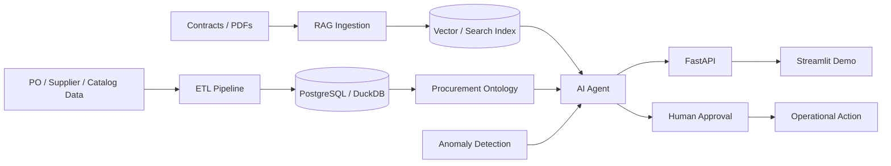

# Enterprise AI Procurement Agent

A portfolio-grade AI Engineer / Forward Deployed Engineer demo that turns procurement data, supplier catalogs, contracts, and purchasing history into an operational decision system.

The project demonstrates:

- Data ingestion and transformation
- Enterprise ontology modeling
- Retrieval-Augmented Generation (RAG)
- Agentic AI workflows
- Price anomaly detection
- Human-in-the-loop decisioning
- FastAPI services
- Streamlit demo UI
- Evaluation and testing
- Docker-based local deployment

## Business Problem

Procurement teams often work across fragmented systems:

- Purchase order history
- Supplier catalogs
- Contract pricing
- Departments and buyers
- Invoice records
- Supplier performance
- Unstructured contract documents

The goal of this project is to answer questions such as:

- Are we paying above our historical price?
- Is there a contracted supplier offering a better price?
- Which purchases should be reviewed first?
- What contract language applies?
- What action should procurement take?

## Architecture



## Ontology

Core objects:

- Supplier
- Product
- Contract
- PurchaseOrder
- PurchaseOrderLine
- Department
- Buyer
- Invoice
- CatalogItem

Example relationships:

- Supplier -> sells -> Product
- Supplier -> governed_by -> Contract
- PurchaseOrder -> contains -> PurchaseOrderLine
- Department -> creates -> PurchaseOrder
- Product -> available_from -> Supplier

## Demo Scenario

Example:

> Investigate PO-23451.

Expected workflow:

1. Retrieve purchase order
2. Identify SKU and supplier
3. Compare historical pricing
4. Compare contracted alternatives
5. Retrieve relevant contract terms
6. Calculate variance and potential savings
7. Produce recommended action
8. Require human approval before execution

Example result:

```text
PO: PO-23451
Requested price: $45.21
Historical median: $24.32
Variance: +85.9%
Alternative supplier: VWR
Alternative price: $26.17
Estimated annual savings: $5,712
Recommendation: Route to contracted supplier
```

## Project Structure

```text
enterprise-ai-procurement-agent/
├── app/
│   ├── api/
│   ├── agents/
│   ├── analytics/
│   ├── core/
│   ├── etl/
│   ├── ontology/
│   ├── rag/
│   └── ui/
├── data/
│   ├── generated/
│   └── raw/
├── docs/
├── tests/
├── .env.example
├── .gitignore
├── docker-compose.yml
├── Dockerfile
├── requirements.txt
└── README.md
```

## Quick Start

### 1. Create a virtual environment

```bash
python -m venv .venv
source .venv/bin/activate
```

Windows:

```bash
.venv\Scripts\activate
```

### 2. Install dependencies

```bash
pip install -r requirements.txt
```

### 3. Generate synthetic procurement data

```bash
python -m app.etl.generate_data
```

### 4. Run the API

```bash
uvicorn app.api.main:app --reload
```

### 5. Run the demo UI

```bash
streamlit run app/ui/streamlit_app.py
```

## API Endpoints

- `GET /health`
- `GET /purchase-orders`
- `GET /purchase-orders/{po_id}`
- `POST /analyze-purchase`
- `POST /agent/investigate`

## AI Engineering Concepts Demonstrated

### RAG
- Contract chunking
- Metadata filtering
- Hybrid retrieval scaffold
- Grounded responses
- Citation-ready result structure

### Agentic AI
- Planner
- Tool execution
- Multi-step investigation
- Structured recommendation
- Human approval boundary

### Data Engineering
- Synthetic source systems
- ETL transformations
- Derived metrics
- Reusable data contracts

### Explainability
- Price variance
- Historical median comparison
- Alternative supplier comparison
- Recommendation rationale

## Palantir FDE Mapping

This project intentionally mirrors an enterprise operational architecture:

| Project Concept | FDE / Foundry-style Concept |
|---|---|
| ETL pipeline | Data integration / transformation |
| Ontology schema | Enterprise object model |
| Procurement objects | Ontology objects |
| Object relationships | Ontology links |
| Agent workflow | AI logic / orchestration |
| Recommendation | Decision support |
| Human approval | Governed action |
| API / UI | Operational application |

## Next Enhancements

- pgvector or Qdrant
- BM25 + dense hybrid retrieval
- cross-encoder reranking
- LLM provider integration
- document ingestion
- role-based access control
- audit logging
- evaluation harness
- LangGraph orchestration
- React frontend
- deployment to cloud
