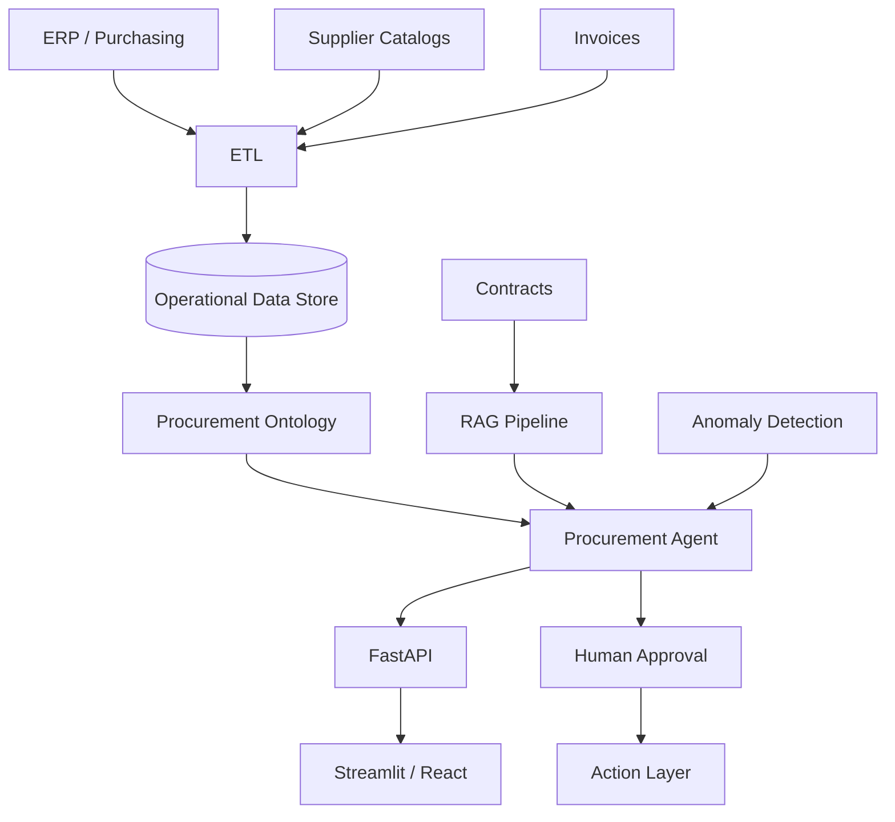

# Architecture

## Goal

Create an operational procurement intelligence platform that combines:

1. enterprise data pipelines
2. business ontology
3. analytics
4. retrieval-augmented generation
5. agent orchestration
6. human approval
7. downstream actions

## Logical Architecture

## Design Principle

The LLM should not directly approve spend.

The system separates:

- deterministic calculations
- retrieval and evidence
- AI explanation
- recommendation
- human approval
- governed action
